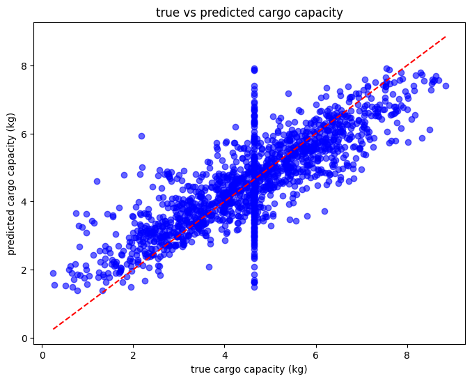

# AI&ML PROJECT24/25-Group16-304231
# Aeropolis
Group16:
captain - 304231, member 2 - 305681, member 3 - 304121
# Introduction
In the city of Aeropolis, delivery drones are essential for transporting goods quickly and efficiently. However, their cargo capacity (Cargo_Capacity_kg) can be affected by many factors, like weather conditions, terrain type, and the quality of their equipment. The primary aim of this project is to build and train a model that predicts the cargo capacity of drones based on multiple environmental and operational factors. These implemented changes would help us to improve delivery efficiency and gain a deeper understanding of impacts of drone performance.

# Methods
- Describe key ideas for data analysis and modeling. Update as you proceed.
**Tools and Environment**
  -programming language: python
  -libraries:pandas, matplotlib, seaborn, scikit - learn, numpy.
  -environment: jupiter notebook
  - how to recreate an environment: Set Up the Conda environment. Use this:  conda env export > environment.yml

This project aims to predict the cargo capacity of drones using environmental and operational factors. We think it is a regression model because the target variable, **Cargo Capacity (kg)**, is a continuous numerical value, which logically makes regression the most suitable approach to use.Let's go deeper, why classification or clustering do not suit our project:
- **Classification** - is used for categorical target variables, where predictions are assigned discrete classes. It doesn't apply to our case because our target variable is a continuous measurement. We cannot assign any class to it.
- **Clustering** - aims to group data points based pn similarity without predifined labels. Can't be applied in the frames of our project because again, **Cargo Capacity (kg)** is a continuous measurement.

To address the problem in the most efficient way, we tested three regression models: **Linear Regression, Random Forest and Gradient Boosting**. Let me explain you why them exactly: 
**Linear Regression** - basically for its simplicity and interpretability. It establishes a linear relashionship between feautures and the target variable. Provides insights into how each feauture contributes to the prediction, which makes it a strong baseline for comparison. Does the job and easy to use, our choice was obvious. 
**Random Forest** - combines multiple decision trees to improve prediction accuracy and reduce overfitting. In addition, captures nonlinear relashionships between feautures and the target variable, which makes it suitable for complex dataset. 
**Gradient Boosting** - build models sequentially, correcting errors of prior iterations and is known for its strong predictive performance and ability to handle complex patterns and relashionships in the data. 
By selecting these models, we ensured a comprehensive analysis of the dataset, while balancing simplicity and advanced capabilities to determine the best-performing model.

Now, I want to go through all of the stages together, so you could understand our thinking process during the course of this project. 
We firstly started our project with **Data Loading and Initial Inspection**.
We did that to understand the dataset we are working by having all of the statistics on data right in fromt of our eyes. There, we got information about the dataset, summary statistics and amount of missing values (in both, numerical and percentage value).

Then, after getting some vision, we moved to **EDA(Explanatory Data Analysis)**. 

In EDA, we aimed to understand patterns, distributions and correlations of the data. We created visualizations to identify outliers, general trends and relashionships between feautures and our target variable **Cargo Capacity(kg)**. 
To understand what we are working with, we first wanted to see a target variable distribution. For that reason, we chose to draw histogram using plt disctionary to plot a histogram. 

As you can see, the plot shows that the target variable is distributed in the way, where the majority of the drones have moderate cargo capacity (can handle moderate amount of weight), while a few can carry significanly less. 
Then, we decided to **detect outliers** to have a better understanding of the distribution of outliers in our feauture. 
**Numerical Feauture Analysis**:
Outliers were identified visually through boxplots of numerical feautures.This helps us to understand and see the data distribution and decide if the it requires outlier handling. This is one of the examples of boxplots we did. 

**Categorical Feauture Analysis**
We used countplots to analyze categorical feautures. It might seem weird that we used it for categories, however, we observed them in terms of frequency. How frequent each of the appear and have an influence on our target value. Since their values are very close to each other, so we added a numerical values on top of each bar, so it will be easier to observe and distinguish them. 
. This is one of the examples of countplots we did. Each of the bars have more or less similar frequencies, which shows that there is a balanced distribution of flight zones.

Now, let's take a closer look into **preprocessing** stage.
In order to preprocess the dataset for modeling, we applied the following steps:

**Handling of missing values**:
Numerical feautures: we instructed it to impute missing values using the mean. We chose this approach because it preserves the central tendency of the data without introducing significant bias.
Categorical Feautures: missing values were filled with mode (most frequent value).It ensures that imputed values align with the distribution of the data while maintaining the interpretability of categorical variables.

**Encoding categorical variables**:
We applied One-Hot Encoding to convert categorical feautires into binary indicators because they are essential for machine learning models that require numerical inputs (like our regression models) and also avoids introducing ordinal relationships that may not exist in the data. 
**Scaling numerical feautures**:
StandardScaler was used to standardize numerical features by centering them around zero with a unit variance. It ensures that all feautures are on a comparable scale, which is important for models sensitive to feauture magnitude, such as Linear Regression and Gradient Boosting.
**Setting a data sample** - our chosen dataset has a training set size of 700000 lines, which is a huge amount of information. To be honest, my laptop could not handle it and stoped working every time I tried to work with a dataset. Therefore, in order to be able to work with it, we decided to work with only 1% of the whole dataset. It ensures the successful completion of the project and saves my laptop from dying.
**Data Splitting**:
We splitted the data into 3 sets: **training (70%), validation (15%) and test(15%)** using randomized splits. This ensures that the models are trained on one dataset, validated on another for hyperparameter tuning, and finally tested on unseen data to evaluate real-world performance.

By performing these preprocessing steps, we ensured that the dataset was well-prepared for model training and evaluation, minimizing potential biases and errors while optimizing model performance.

**Model Training**
For each model, we integrated preprocessing into a Pipeline, ensuring that all data transformations occurred consistently during training and evaluation. The models were first trained using default hyperparameters, and performance was measured on the validation set.

**Hyperparameter Tuning**
We performed **cross-validation** to fine-tune model hyperparameters for optimal performance. The tuning process used 2-fold cross-validation and R² as the scoring metric. However, it is important to mention that it was only applied to Random Forest and Gradient Boosting models GridSearchCV to identify the best parameter combinations. Linear Regression did not need it because it has no tunable parameters. We just directly trained and evaluated the model. 

**Model Evaluation**
We chose R² (Coefficient of Determination), RMSE (Root Mean Squared Error) and MAE (Mean Absolute Error) as our metrics for evaluation of each model to identify thhe best one for our project. 
**R² (Coefficient of Determination)** - measure of how well the model explains the variance in the target variable. The higher it is, more effective model is working.
**RMSE (Root Mean Squared Error)** - penalizes larger errors more than smaller ones, making a model sensitive to outliers. This metric is particularly useful for real-world interpretability, as you can better understand how far, on average, the predictions deviate from actual values.

# Experimental Design
- Placeholder for experimental setup (model choices, metrics).

# Results
## Main Findings
The final results indicate that the Linear Regression model performed the best among the models tested, demonstrating the highest R² score of 0.70 and the lowest RMSE of 0.88 on the test set. The R² score suggests that the model explains 70% of the variance in cargo capacity, indicating a strong relationship between the features and the target variable. The RMSE of 0.88 means that, on average, the model’s predictions are off by just 0.88 kg, which is relatively low, indicating that the model makes accurate predictions. These results emphasize the model's reliability in capturing the relationship between the input features and cargo capacity, while maintaining computational efficiency.
### Model Performance Comparison
The table below summarizes the performance of the three models evaluated, due to its combination of the highest R² score and the lowest RMSE.
| Model               | R²   | RMSE  |
|---------------------|-------|-------|
| Linear Regression   | 0.70  | 0.88  |
| Random Forest       | 0.69  | 0.89  |
| Gradient Boosting   | 0.69  | 0.88  |

- **R² (R-squared)** indicates how well the model explains the variance in the target variable. A higher R² means the model captures more of the underlying patterns, so we aim for the highest R² possible.
- **RMSE (Root Mean Squared Error)** measures the average error between predicted and actual values. A lower RMSE means the model makes more accurate predictions.

By selecting the highest R² and lowest RMSE, we ensure the model both fits the data well and provides accurate predictions.

### Results Visualization 
This scatter plot is based on the predictions from the Linear Regression model compared to the actual test set values. The purpose of creating this plot was to see how well the model's predictions align with reality. The red dashed line represents perfect predictions, where the predicted values match the actual ones. 

#### Observations From Scatter Plot:

- **Overall Accuracy**:  
  Most points are clustered around the red line, indicating that the model performs well for the majority of predictions.
- **Extreme Values**:  
  There are noticeable deviations at the higher and lower ends of cargo capacities, suggesting the model struggles with extreme cases.
- **Error Distribution**:  
  The scatter around the line appears relatively consistent, meaning the prediction errors are fairly evenly distributed and do not show strong systematic bias.

This visualization makes it easier to spot patterns, like how the model handles typical values well but struggles a bit with extreme cases.
# Conclusions
#### Key Takeaways
This project demonstrated the potential of using machine learning models, specifically Linear Regression, to predict drone cargo capacity based on various factors. The model achieved solid performance with an R² of 0.70 and an RMSE of 0.88, showing good predictive accuracy for the majority of test cases, and highlighting the relationship between the various features and cargo capacity. These results underscore the model’s ability to effectively capture the relationship between input features and cargo capacity, also suggest that this approach could be a reliable tool for understanding and predicting drone performance in real-world applications.

#### Unanswered Questions & Future Work
However, some questions are still unanswered. For example, the impact of certain environmental factors like wind speed or temperature could not be fully explored due to limitations in the dataset. Additionally, more complex models or feature engineering might improve prediction accuracy, especially for extreme values. In the ffuture work, we could explore using more advanced techniques such as ensemble methods or neural networks, and further collect data to refine our model and include additional factors that may better explain cargo capacity variability.

