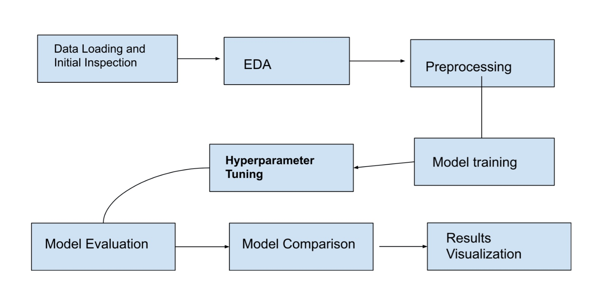
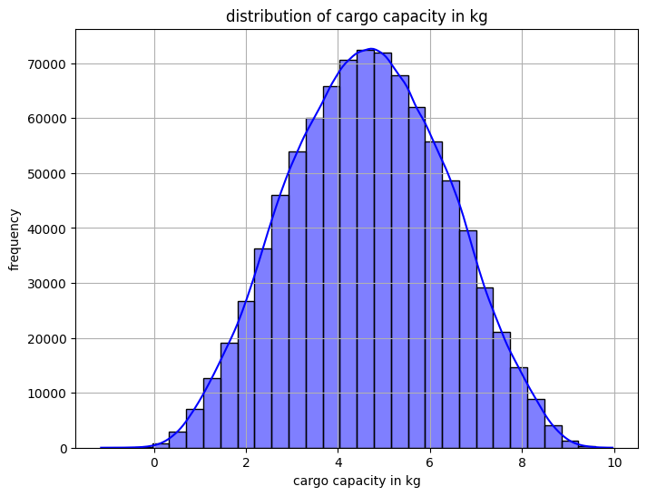
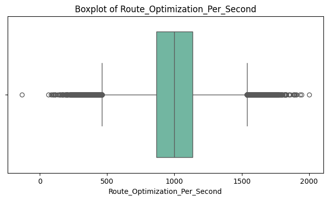
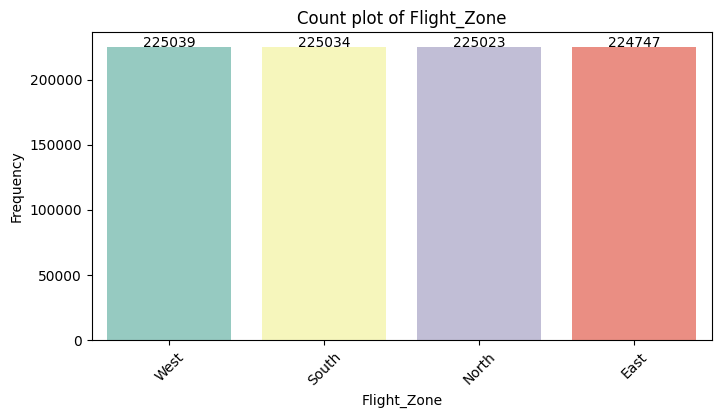

# Drone Cargo Capacity Prediction — Aeropolis Dataset

**Course:** Artificial Intelligence & Machine Learning — Luiss Guido Carli (2024/25)  
**Team:** Sabina Nurseitova, Ziyi Dong  
**Type:** Supervised Regression | Team Project

---

# Introduction

In the fictional city of Aeropolis, autonomous delivery drones are the backbone of urban logistics. This project builds a machine learning pipeline to **predict how much cargo (in kg) a drone can carry per flight**, based on 19 environmental and operational features such as weather conditions, terrain type, wind speed, battery type, and autopilot quality.

Accurate cargo prediction can help optimize delivery scheduling, reduce fuel waste, and improve overall drone fleet efficiency.

---

# Dataset

- **Source:** Aeropolis dataset (provided as part of the AI & ML course)
- **Size:** ~700,000 rows × 20 features
- **Target variable:** `Cargo_Capacity_kg` (continuous — regression problem)
- **Key features include:** `Air_Temperature_Celsius`, `Wind_Speed_kmph`, `Terrain_Type`, `Weather_Status`, `Quantum_Battery`, `Autopilot_Quality_Index`, `Flight_Duration_Minutes`

> Due to hardware constraints, we worked on a **1% random sample (~7,000 rows)** using `data.sample(frac=0.01, random_state=42)` to ensure reproducibility.

---

# Methods
## Tools and Environment
  - **Programming Language**: Python
  - **Libraries**:pandas, matplotlib, seaborn, scikit - learn, numpy.
  - **Environment**: Jupyter Notebook
  - **How to recreate an environment**: Set Up the Conda environment. Use this to recreate it:  conda env export > environment.yml command.

**flowchart that illustrates the steps in our machine learning system**


## Why Regression?

This is a regression problem because the target variable, **Cargo Capacity (kg)**, is a continuous numerical variable. Classification and clustering do not apply here:
- **Classification**: Used for categorical target variables with discrete classes. Not applicable to a continuous measurement.
- **Clustering**: Groups data points based on similiarity without predefined labels. Not applicable to a continuous measurement. 

## Models

To address the problem while balancing simplicity and complexity, we tested three regression models: 

- **Linear Regression**: Interpretable baseline that establishes a linear relationship between features and the target variable, providing insights into how each feature contributes to the prediction. 
- **Random Forest**: Combines multiple decision trees to improve accuracy and reduce overfitting. It captures non-linear relationships between features and the target variable. 
- **Gradient Boosting**: Builds models sequentially, correcting errors of prior iterations. It is known for strong predictive performance on complex patterns.

## Pipeline Steps

We started with **Data Loading and Initial Inspection** to understand the dataset structure, summary statistics, and missing value counts. Then we moved to **EDA**, followed by preprocessing, model training, and evaluation.

### EDA

We aimed to understand patterns, distributions, and correlations in the data.

**Target variable distribution:**



The histogram shows that most drones have moderate cargo capacity, while a few carry significantly less.

**Numerical feature analysis** — boxplots were used to identify outliers across numerical features:



**Categorical feature analysis** — countplots with value labels were used to observe frequency distributions. All categories were similarly balanced:



### Preprocessing

| Step | Numerical Features | Categorical Features |
|---|---|---|
| Missing values | Mean imputation | Mode imputation |
| Encoding | — | One-Hot Encoding |
| Scaling | StandardScaler | — |

All preprocessing was wrapped in a scikit-learn `Pipeline` to prevent data leakage and ensure consistent transformations during training and evaluation.

### Data Splitting

| Set | Proportion |
|---|---|
| Training | 70% |
| Validation | 15% |
| Test | 15% |

### Hyperparameter Tuning

`GridSearchCV` with 2-fold cross-validation was applied to Random Forest and Gradient Boosting. Parameters tuned: `n_estimators`, `max_depth`, `min_samples_split`, `min_samples_leaf`, `learning_rate`. Linear Regression was evaluated directly as it has no tunable parameters.

---

# Experimental Design
## Experiment: Model Comparison and Evaluation

### The Main Purpose:
Evaluate and compare three regression models on the Aeropolis dataset to identify the most accurate approach for predicting drone cargo capacity.

### Baselines:
- **Baseline Model**: Linear Regression was chosen as the baseline due to its simplicity and widespread use in regression problems. It provides a straightforward benchmark for comparing more complex models.
- **Comparison Models**: Random Forest and Gradient Boosting were selected as alternative models, given their effectiveness in capturing non-linear relationships and complex patterns in the data.

### Evaluation Metrics:
- **R² (R-squared)**: measures how well the model explains the variance in cargo capacity. A higher R² indicates a better fit between the model's predictions and the actual values, showing the model's ability to capture the underlying trends.
  
- **RMSE (Root Mean Squared Error)**: measures the average prediction error. Lower RMSE values suggest that the model is more accurate in its predictions. This metric is particularly useful in evaluating the model's performance relative to the scale of the cargo capacity.

---

# Results
## Model Performance on Test Set

| Model | R² | RMSE (kg) |
|---|---|---|
| **Linear Regression** | **0.70** | **0.88** |
| Random Forest | 0.69 | 0.89 |
| Gradient Boosting | 0.69 | 0.88 |

**Best model: Linear Regression**

- **R² = 0.70** — the model explains 70% of the variance in drone cargo capacity
- **RMSE = 0.88 kg** — on average, predictions deviate from actual values by less than 1 kg

Despite being the simplest model, Linear Regression outperformed both ensemble methods, suggesting that the relationship between features and cargo capacity is largely linear.

## Results Visualization


**Observations:**
- **Overall accuracy:** Most points cluster around the red line, indicating the model performs well for the majority of predictions.
- **Extreme values:** Noticeable deviations at the higher and lower ends suggest the model struggles with extreme cargo capacities.
- **Error distribution:** The scatter around the line is fairly consistent — no strong systematic bias.

---

# Conclusions

## Key Takeaways

This project demonstrated that Linear Regression can effectively predict drone cargo capacity based on environmental and operational factors, achieving an R² of 0.70 and an RMSE of 0.88. These results suggest a reliable linear relationship between the input features and cargo capacity, making this a practical tool for understanding and optimizing drone performance.

## Unanswered Questions & Future Work

The impact of certain environmental factors like wind speed or temperature could not be fully explored due to dataset limitations. More complex models or additional feature engineering might improve accuracy, especially for extreme values. Future work could explore neural networks, ensemble methods, or working with the full 700,000-row dataset using cloud computing resources.

---

## Repository Structure

```
├── main.ipynb          
├── aeropolis.csv       
├── README.md           
└── images/             
    ├── true_vs_predicted_cargo_capacity.png
    ├── distribution_of_cargo_capacity_in_kg.png
    ├── boxplot_of_route_optimization_per_second.png
    └── countplot_of_flight_zone.png
```

## How to Run

1. Clone the repository
2. Install dependencies: `pip install pandas numpy scikit-learn matplotlib seaborn`
3. Open `main.ipynb` in Jupyter Notebook or Google Colab
4. Update the dataset path in cell 2 to your local path
5. Run all cells in order
