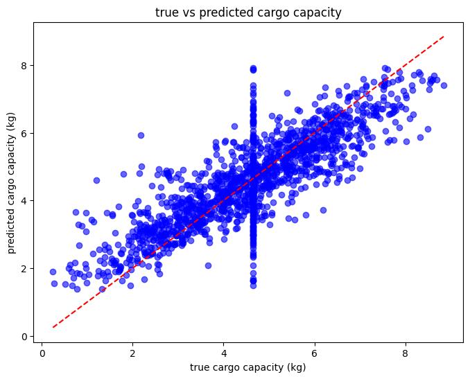

# Drone Cargo Capacity Prediction — Aeropolis Dataset

**Course:** Artificial Intelligence & Machine Learning — Luiss Guido Carli (2024/25)  
**Team:** Sabina Nurseitova, Ziyi Dong  
**Type:** Supervised Regression | Team Project

---

## Overview

In the fictional city of Aeropolis, autonomous delivery drones are the backbone of urban logistics. This project builds a machine learning pipeline to **predict how much cargo (in kg) a drone can carry per flight**, based on 19 environmental and operational features such as weather conditions, terrain type, wind speed, battery type, and autopilot quality.

Accurate cargo prediction can help optimize delivery scheduling, reduce fuel waste, and improve overall drone fleet efficiency.

---

## Dataset

- **Source:** Aeropolis dataset (provided as part of the AI & ML course)
- **Size:** ~700,000 rows × 20 features
- **Target variable:** `Cargo_Capacity_kg` (continuous — regression problem)
- **Key features include:** `Air_Temperature_Celsius`, `Wind_Speed_kmph`, `Terrain_Type`, `Weather_Status`, `Quantum_Battery`, `Autopilot_Quality_Index`, `Flight_Duration_Minutes`

> Due to hardware constraints, we worked on a **1% random sample (~7,000 rows)** using `data.sample(frac=0.01, random_state=42)` to ensure reproducibility.

---

## Methods

### Tools & Environment
- **Language:** Python 3
- **Libraries:** `pandas`, `NumPy`, `scikit-learn`, `Matplotlib`, `Seaborn`
- **Environment:** Jupyter Notebook / Google Colab

To recreate the environment:
```bash
pip install pandas numpy scikit-learn matplotlib seaborn
```

### ML Pipeline

```
Raw Data → EDA → Preprocessing → Data Split → Model Training → Hyperparameter Tuning → Evaluation
```

### 1. Exploratory Data Analysis (EDA)
- Visualized target variable distribution via histogram — approximately normal with slight left skew
- Identified outliers in numerical features (e.g. `Route_Optimization_Per_Second`) using boxplots
- Analyzed categorical feature balance using countplots — all categories (e.g. `Flight_Zone`: North/South/East/West) were evenly distributed
- Built a correlation heatmap across all numerical features

### 2. Preprocessing
| Step | Numerical Features | Categorical Features |
|---|---|---|
| Missing values | Mean imputation | Mode imputation |
| Encoding | — | One-Hot Encoding |
| Scaling | StandardScaler | — |

All preprocessing was wrapped in a `scikit-learn Pipeline` to prevent data leakage.

### 3. Data Split
| Set | Proportion |
|---|---|
| Training | 70% |
| Validation | 15% |
| Test | 15% |

### 4. Models Trained
We tested three regression models, chosen to balance simplicity and complexity:

- **Linear Regression** — interpretable baseline; reveals feature-weight relationships
- **Random Forest** — ensemble of decision trees; handles non-linear relationships
- **Gradient Boosting** — sequential error-correcting ensemble; strong on complex patterns

### 5. Hyperparameter Tuning
- `GridSearchCV` with 2-fold cross-validation applied to Random Forest and Gradient Boosting
- Tuned parameters: `n_estimators`, `max_depth`, `min_samples_split`, `min_samples_leaf`, `learning_rate`
- Linear Regression was evaluated directly (no tunable parameters)

---

## Results

### Model Performance on Test Set

| Model | R² | RMSE (kg) |
|---|---|---|
| **Linear Regression** | **0.70** | **0.88** |
| Random Forest | 0.69 | 0.89 |
| Gradient Boosting | 0.69 | 0.88 |

**Best model: Linear Regression**

- **R² = 0.70** — the model explains 70% of the variance in drone cargo capacity
- **RMSE = 0.88 kg** — predictions are off by less than 1 kg on average

Despite being the simplest model, Linear Regression outperformed both ensemble methods — suggesting that the relationship between features and cargo capacity is largely linear.

### True vs. Predicted Cargo Capacity

The scatter plot below shows predicted vs. actual values. Points close to the red dashed line indicate accurate predictions.



**Key observations:**
- The model performs well for the majority of drones (moderate cargo range)
- Slight deviations appear at extreme values — the model underestimates very high capacities and overestimates very low ones
- Error distribution is fairly uniform, showing no strong systematic bias

---

## Key Takeaways

- A linear model was sufficient to achieve solid predictive performance, suggesting the features relate to cargo capacity in a largely linear way
- StandardScaler was essential for Linear Regression and Gradient Boosting, as both are sensitive to feature magnitude
- Sampling at 1% of the dataset enabled practical experimentation while maintaining statistical representativeness

---

## Limitations & Future Work

- The dataset is synthetic; real-world drone data may introduce more complex, non-linear patterns
- Environmental factors like wind gusts or temperature fluctuations over time were not fully captured
- Future work could explore: neural networks, additional feature engineering, or using the full 700k-row dataset with cloud computing resources

---

## Repository Structure

```
├── main.ipynb          # Full annotated notebook (EDA → modeling → evaluation)
├── aeropolis.csv       # Dataset
├── README.md           # This file
└── images/             # Plots referenced in README
    ├── true_vs_predicted_cargo_capacity.png
    ├── distribution_of_cargo_capacity_in_kg.png
    ├── boxplot_of_route_optimization_per_second.png
    └── countplot_of_flight_zone.png
```

---

## How to Run

1. Clone the repository
2. Install dependencies: `pip install pandas numpy scikit-learn matplotlib seaborn`
3. Open `main.ipynb` in Jupyter Notebook or Google Colab
4. Update the dataset path in cell 2 to your local path
5. Run all cells in order
